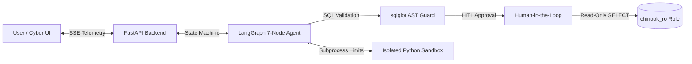

# SQL Data Cockpit

An autonomous, defense-in-depth **Natural Language to SQL & Analytics Agent** built with **LangGraph**, **FastAPI**, **PostgreSQL**, and **React + Vite**.

---

## Architecture & Agent Pipeline



### Core Pipeline
1. **Semantic Intent & Schema Pruning:** Parses natural language and prunes table context dynamically.
2. **AST Security Guard:** Validates generated SQL via `sqlglot` AST parsing—strictly allowing `SELECT` statements while blocking DDL/DML (`DROP`, `ALTER`, `INSERT`) and multi-statement injection.
3. **Human-in-the-Loop Checkpoint:** Pauses execution at a review node (`human_review`), streaming live approval cards to the UI for explicit authorization before executing query modifications.
4. **Isolated Analytics Sandbox:** Executes Python visualization code (`pandas`, `matplotlib`) inside an OS-enforced subprocess sandbox with CPU (`RLIMIT_CPU`) and memory (`RLIMIT_AS`) limits.

---

## Key Highlights

- **Dual-Database Isolation:** The LLM executes SQL through a restricted, read-only database role (`chinook_ro`), completely isolated from the read-write application schema (`app_db`).
- **Live Chain-of-Thought UI:** Obsidian glassmorphic interface that streams agent reasoning steps, SQL queries, tabular datasets, and Base64-encoded charts in real time.
- **Autonomous Self-Correction:** Automatic retry loop that passes execution feedback back to the LLM to recover from query syntax or schema errors.
- **109 Automated Tests:** Comprehensive test coverage across red-team prompt injections, HITL state isolation, JWT authentication, and sandbox constraints.

---

## Quick Start

### 1. Launch with Docker Compose
```bash
# Set your Groq API key
export GROQ_API_KEY="your_api_key_here"

# Launch multi-container production build
docker compose up -d --build
```

- **Frontend Cockpit:** [http://localhost:3000](http://localhost:3000)
- **Backend API Docs:** [http://localhost:8000/docs](http://localhost:8000/docs)

---

## Running Tests

Run the full automated test suite (`109 tests`) inside the container:
```bash
docker exec -e PYTHONPATH=/app text2sql_backend pytest backend/tests/ -v
```
